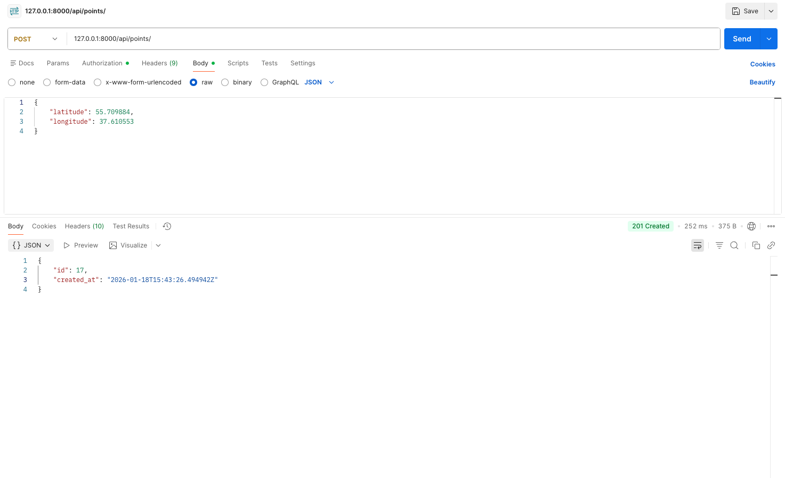
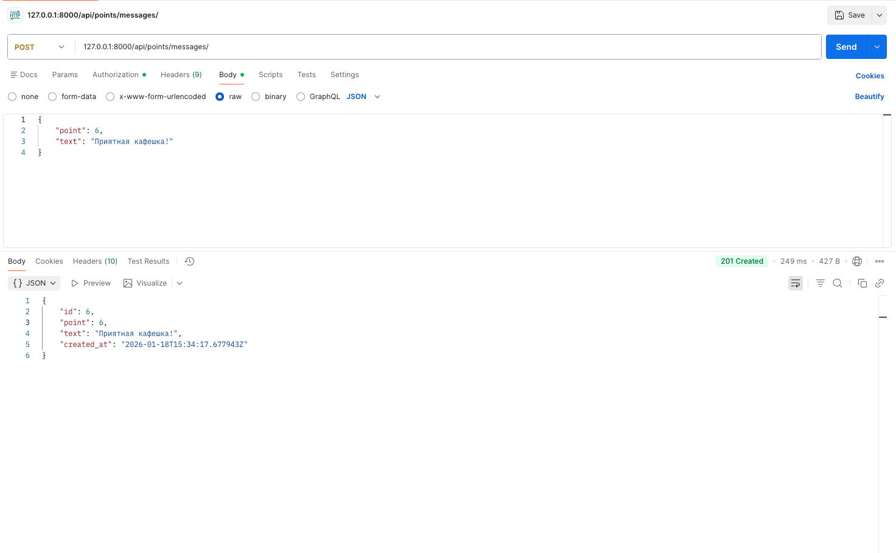
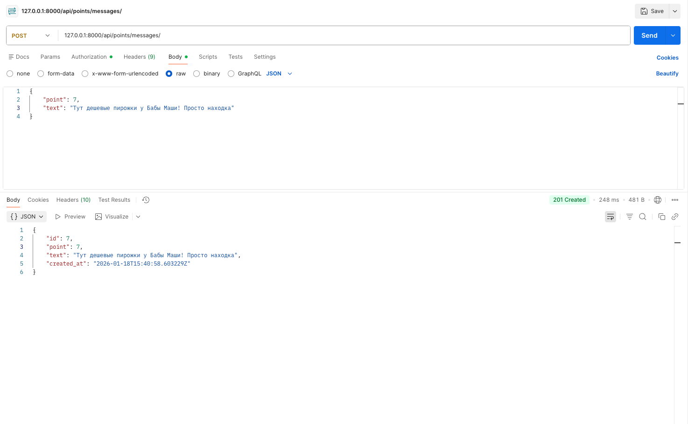
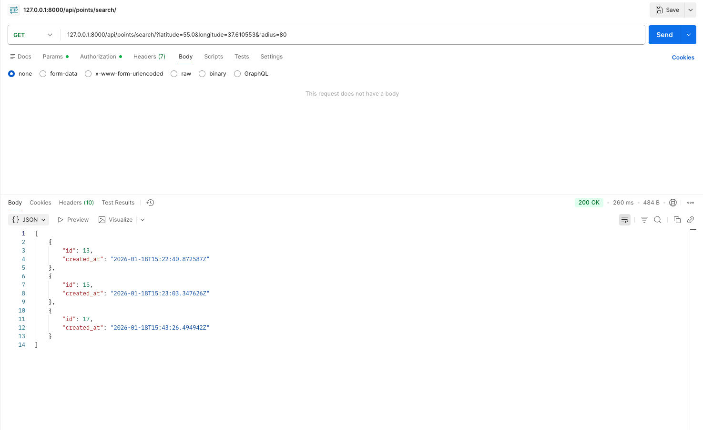
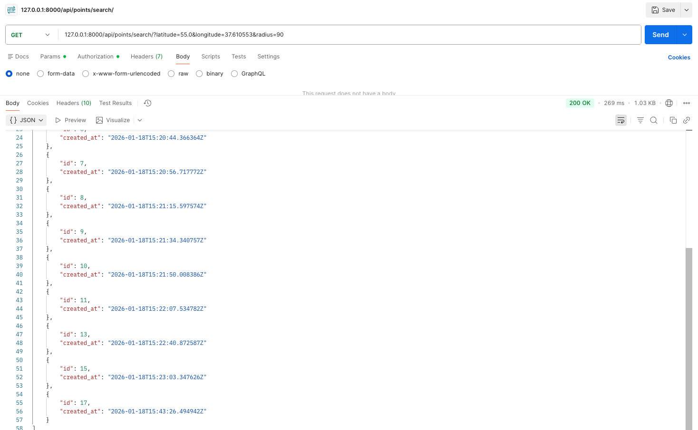
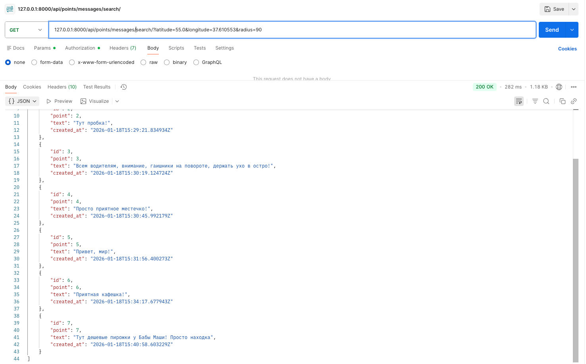
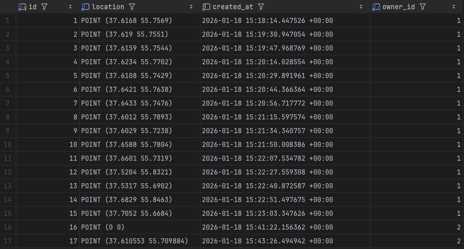
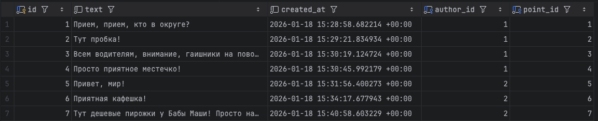

# Проект по Geo REST API

-----------

Разработать backend-приложение на Django для работы с географическими точками на карте. 
Приложение должно предоставлять REST API для создания точек, обмена сообщениями и поиска контента в заданном радиусе от указанных координат.

-----------
### Примечания

1. В проекте реализован Basic Auth
2. Geodjango-зависимости(GEOS, PROJ, GDAL) были установлены вручную из исходников, согласно одному из способов, описанным в документации. Остальные пакеты есть в `requirements.txt`
3. Шаблон `.gitignore` используется из этого репозитория [github/gitignore](https://github.com/github/gitignore/tree/main)

## Дергаем ручки в Postman

-----------
### POST запросы

-----------

-----------

-----------

### GET запросы 

-----------

-----------

-----------

## Таблицы из PostgreSQL

-----------

